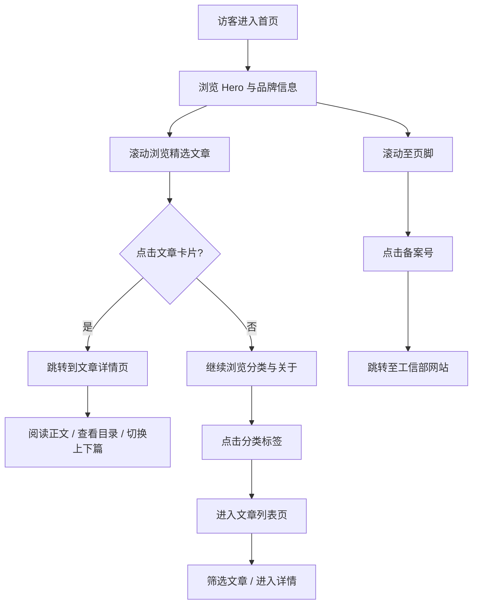

# 檬橙博客官网 PRD

## 1. 产品概述

檬橙博客是一个面向技术与生活记录的个人博客官方网站，以"清新、灵感、记录"为核心调性，承载博主的原创文章、技术笔记、生活随想等内容。目标用户为喜欢阅读技术博客、追求精致阅读体验的开发者与读者群体；通过一个具有质感的官网入口展示博主个人品牌、内容分类与精选文章。

## 2. 核心功能

### 2.1 用户角色
本项目为博客展示型官网，无登录注册模块，所有用户均为访客角色。

| 角色 | 注册方式 | 核心权限 |
|------|----------|----------|
| 访客 | 无需注册 | 浏览首页、阅读文章列表、查看文章详情、跳转外部链接 |

### 2.2 功能模块
1. **首页**：Hero 区域、博主简介、文章精选、分类导航、归档、关于我、底部备案
2. **文章列表页**：按分类/标签筛选的文章卡片网格
3. **文章详情页**：文章正文、目录、阅读进度、上一篇/下一篇
4. **关于页**：博主的详细介绍、技能栈、联系方式

### 2.3 页面详情

| 页面名称 | 模块名称 | 功能描述 |
|---------|---------|---------|
| 首页 | Hero 区域 | 品牌名、动态打字标语、CTA 按钮、装饰性柠檬橙插画 |
| 首页 | 文章精选 | 精选 3-6 篇文章卡片，含封面、标题、摘要、标签 |
| 首页 | 分类导航 | 卡片式分类（前端、后端、生活、随笔）|
| 首页 | 关于我 | 简短个人介绍 + 社交链接 |
| 首页 | 页脚 | 备案号居中显示并链接至工信部 |
| 文章列表 | 筛选器 | 分类/标签切换 |
| 文章列表 | 文章网格 | 卡片化展示，每页 9 条 |
| 文章详情 | 文章头图 | 标题、发布时间、阅读时长、标签 |
| 文章详情 | 正文区 | 支持 Markdown 风格的排版 |
| 文章详情 | 目录 | 右侧悬浮目录（桌面端）|
| 关于 | 详细介绍 | 头像、简介、技能标签、社交链接 |

## 3. 核心流程

## 4. 用户界面设计

### 4.1 设计风格
- **主色调**：暖米白底 (#FBF8F3) + 柠橙渐变 (#F7C04A → #F08A4B) 作为强调色；深色文字 (#1F1B16)；次级灰 (#6B6660)
- **辅色**：薄荷绿 (#A8C8B5) 作为对比点缀；柔粉 (#F4B6B6) 作为情感点缀
- **按钮风格**：圆角胶囊按钮，主按钮为渐变填充 + 柔阴影；次按钮为细描边
- **字体**：标题用 `Fraunces` 或 `Noto Serif SC`（衬线、编辑感）；正文用 `Inter` 或 `Noto Sans SC`
- **布局风格**：编辑杂志风 + 卡片化混排，桌面端 12 栅格，移动端单列流式
- **图标/插画**：手绘风柠檬橙插画 + Lucide 图标线性风格

### 4.2 页面设计概述

| 页面名称 | 模块名称 | UI 元素 |
|---------|---------|---------|
| 首页 | Hero | 全屏高度，标题居中偏左，渐变文字，背景米色 + 装饰圆斑，CTA 双按钮 |
| 首页 | 精选文章 | 三列卡片，封面占顶部 60%，悬停时上浮 + 阴影加深 |
| 首页 | 分类导航 | 2x2 圆角大卡片，渐变描边背景，hover 时柠橙光晕 |
| 首页 | 关于我 | 头像 + 简介 + 社交链接图标 |
| 首页 | 页脚 | 米色底，居中显示版权与备案号，备案号带图标 |
| 文章列表 | 筛选器 | 顶部胶囊 chip 切换，激活态渐变填充 |
| 文章详情 | 文章头 | 居中标题，标签胶囊，元信息灰字 |
| 文章详情 | 正文 | 最大宽度 720px，行高 1.85，两端对齐 |
| 关于 | 技能标签 | 圆角胶囊，多色背景 |

### 4.3 响应式
- 桌面优先（≥1024px）：12 栅格
- 平板（768-1023px）：8 栅格，卡片变两列
- 移动端（<768px）：单列，导航变汉堡菜单

### 4.4 3D 场景指导
不适用（无 3D 场景需求）。

## 5. 特殊要求

- **页脚备案号**：在所有页面底部中央位置清晰展示"桂ICP备2021007060号-1"，并以链接形式跳转至 `https://beian.miit.gov.cn`，需配工信部图标，符合中国大陆网站备案展示规范。
