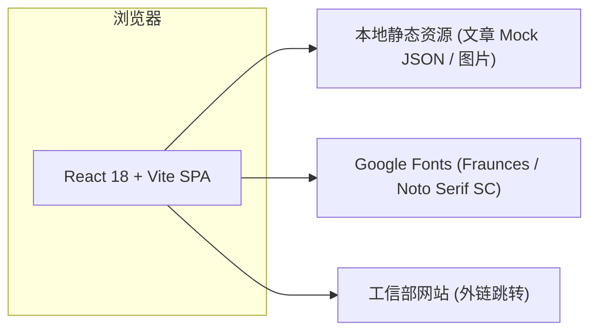
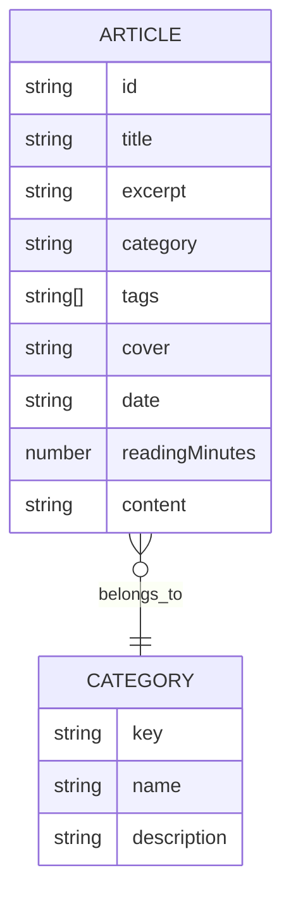

# 檬橙博客官网技术架构

## 1. 架构设计



无后端服务、无数据库，文章以本地 JSON mock 数据提供，简化部署并保证静态站点可托管在任意 CDN。

## 2. 技术说明

- **前端框架**：React 18 + Vite 5
- **样式方案**：Tailwind CSS 3（使用 CSS 变量定制柠橙品牌色）
- **路由**：React Router 6
- **动画**：Framer Motion（页面切换、卡片入场）
- **图标**：Lucide React
- **字体**：Google Fonts（Fraunces 衬线展示 + Noto Serif SC 中文）
- **初始化工具**：vite-init（手动初始化项目结构）
- **后端**：无
- **数据库**：无，使用 mock 数据

## 3. 路由定义

| 路由 | 用途 |
|------|------|
| `/` | 首页（Hero、精选文章、分类、关于、页脚） |
| `/articles` | 文章列表页（按分类筛选） |
| `/articles/:id` | 文章详情页 |
| `/about` | 关于我页面 |
| `*` | 404 兜底页 |

## 4. API 定义

无后端 API，文章数据来自 `src/data/articles.json`，结构如下：

```ts
type Article = {
  id: string;
  title: string;
  excerpt: string;
  category: 'frontend' | 'backend' | 'life' | 'notes';
  tags: string[];
  cover: string;
  date: string;          // ISO 8601
  readingMinutes: number;
  content: string;       // Markdown
};
```

## 5. 服务端架构图

不适用（无后端）。

## 6. 数据模型

### 6.1 数据模型定义



### 6.2 数据定义语言（JSON 示意）

```json
{
  "articles": [
    {
      "id": "hello-mengch",
      "title": "你好，檬橙",
      "excerpt": "这是檬橙博客的第一篇文章，聊聊为什么要开始写博客。",
      "category": "life",
      "tags": ["随笔", "开篇"],
      "cover": "https://trae-api-cn.mchost.guru/api/ide/v1/text_to_image?prompt=lemon+orange+blog+warm+light&image_size=landscape_16_9",
      "date": "2026-06-01",
      "readingMinutes": 4,
      "content": "## 开篇\n\n这是檬橙博客的第一篇文章……"
    }
  ],
  "categories": [
    { "key": "frontend", "name": "前端", "description": "Web、动效、组件设计" },
    { "key": "backend",  "name": "后端", "description": "服务端、数据库、架构" },
    { "key": "life",     "name": "生活", "description": "日常、随笔、思考" },
    { "key": "notes",    "name": "笔记", "description": "读书、学习、备忘" }
  ]
}
```

## 7. 关键组件结构

```
src/
├── components/
│   ├── Navbar.tsx        // 顶部导航 + 移动端汉堡菜单
│   ├── Hero.tsx          // 首页 Hero 区域
│   ├── ArticleCard.tsx   // 文章卡片
│   ├── CategoryGrid.tsx  // 分类导航
│   ├── AboutTeaser.tsx   // 首页关于简介
│   ├── Footer.tsx        // 页脚 + 备案号
│   └── BeianBadge.tsx    // 备案号徽章（带工信部图标）
├── pages/
│   ├── Home.tsx
│   ├── ArticleList.tsx
│   ├── ArticleDetail.tsx
│   ├── About.tsx
│   └── NotFound.tsx
├── data/articles.json
├── App.tsx
└── main.tsx
```

## 8. 部署说明

- 构建产物为纯静态文件（`dist/`），可部署至 Vercel / Netlify / GitHub Pages / 任意静态服务器
- 备案号作为可见外链，符合工信部展示要求
